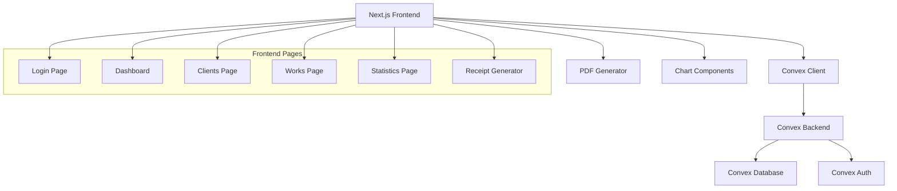

# Design Document

## Overview

The Client Transaction Manager is a single-user web application designed for small business operations in India with a focus on clean, minimal, and elegant design. The system provides comprehensive client and transaction management with Indian-specific features including Rupee currency formatting, DD/MM/YYYY date format, and support for common Indian business services. 

**Design Philosophy:**
- Clean, minimal, and elegant interface
- Mobile-first responsive design
- Clutter-free layouts that focus on essential functionality
- Consistent use of shadcn/ui components for professional appearance
- Single-purpose focus: do client and transaction management perfectly
- Intuitive user experience that requires minimal learning curve

The application follows a modern full-stack architecture using Next.js 15 with React 19 for the frontend, Convex.dev for the backend and real-time data synchronization, and Convex Auth for secure password-based authentication.

## Architecture

### Technology Stack

**Frontend:**
- Next.js 15 with App Router
- React 19 with TypeScript
- Tailwind CSS 4 for styling
- shadcn/ui components for consistent UI
- Lucide React for icons

**Backend:**
- Convex.dev for database and real-time synchronization
- Convex Auth with Password provider for authentication
- Server-side functions for business logic

**Additional Libraries:**
- jsPDF or react-pdf for PDF receipt generation
- Recharts or Chart.js for analytics visualization
- date-fns for Indian date formatting

### System Architecture



## UI/UX Design Principles

### Design System
- **Primary Components**: Use shadcn/ui components exclusively where available
- **Custom Components**: Only create custom components when shadcn/ui doesn't provide the functionality
- **Consistency**: Maintain consistent spacing, typography, and color schemes throughout
- **Accessibility**: Ensure all components meet accessibility standards

### Layout and Spacing
- **Breathing Room**: Adequate white space between elements without being excessive
- **Grid System**: Use CSS Grid and Flexbox for clean, responsive layouts
- **Consistent Spacing**: Use Tailwind's spacing scale (4, 6, 8, 12, 16, 24px) consistently
- **Visual Hierarchy**: Clear distinction between primary, secondary, and tertiary content

### Mobile-First Design
- **Responsive Breakpoints**: Design for mobile first, then enhance for larger screens
- **Touch-Friendly**: Minimum 44px touch targets for mobile interactions
- **Navigation**: Collapsible navigation for mobile with easy access to key features
- **Content Priority**: Show most important information first on smaller screens

### Color and Typography
- **Color Palette**: Use shadcn/ui's default color system with minimal custom colors
- **Typography**: Clean, readable fonts with proper hierarchy (h1, h2, h3, body, caption)
- **Contrast**: Ensure proper contrast ratios for accessibility
- **Status Colors**: Consistent use of colors for success, warning, error, and info states

### Interaction Design
- **Feedback**: Immediate visual feedback for all user actions
- **Loading States**: Skeleton loaders and progress indicators using shadcn/ui components
- **Error Handling**: Clear, actionable error messages with recovery options
- **Confirmation**: Confirmation dialogs for destructive actions

### Content Strategy
- **Clarity**: Clear, concise labels and descriptions
- **Scannable**: Easy to scan lists and tables with proper alignment
- **Progressive Disclosure**: Show essential information first, details on demand
- **Empty States**: Helpful empty states that guide users to take action

## Components and Interfaces

### Database Schema

```typescript
// Convex Schema Extensions
export default defineSchema({
  ...authTables,
  
  clients: defineTable({
    name: v.string(),
    dateOfBirth: v.string(), // DD/MM/YYYY format
    address: v.string(),
    phone: v.string(),
    email: v.optional(v.string()),
    panNumber: v.optional(v.string()),
    aadharNumber: v.optional(v.string()),
    usualWorkType: v.union(
      v.literal("online-work"),
      v.literal("health-insurance"),
      v.literal("life-insurance"),
      v.literal("income-tax"),
      v.literal("mutual-funds"),
      v.literal("others")
    ),
    balance: v.number(), // Positive = client owes business, Negative = business owes client
    createdAt: v.number(),
    updatedAt: v.number(),
  }).index("by_name", ["name"])
    .index("by_work_type", ["usualWorkType"])
    .index("by_balance", ["balance"]),

  works: defineTable({
    clientId: v.id("clients"),
    transactionDate: v.string(), // DD/MM/YYYY format
    totalPrice: v.number(), // Amount in paise (₹1 = 100 paise)
    paidAmount: v.number(), // Amount in paise
    workType: v.union(
      v.literal("online-work"),
      v.literal("health-insurance"),
      v.literal("life-insurance"),
      v.literal("income-tax"),
      v.literal("mutual-funds"),
      v.literal("others")
    ),
    description: v.string(),
    paymentStatus: v.union(
      v.literal("paid"),
      v.literal("partial"),
      v.literal("unpaid")
    ),
    createdAt: v.number(),
    updatedAt: v.number(),
  }).index("by_client", ["clientId"])
    .index("by_date", ["transactionDate"])
    .index("by_payment_status", ["paymentStatus"])
    .index("by_work_type", ["workType"]),
});
```

### Core Components

#### Authentication Components
- `LoginForm`: Password-based login using Convex Auth
- `AuthProvider`: Wraps the application with authentication context
- `ProtectedRoute`: Ensures authenticated access to protected pages

#### Layout Components
- `AppLayout`: Clean main layout using shadcn/ui layout patterns with proper spacing
- `Navigation`: Mobile-first navigation using shadcn/ui navigation components
- `Header`: Minimal top header with essential user info using shadcn/ui header
- `PageHeader`: Clean page headers with shadcn/ui typography and spacing

#### Client Management Components
- `ClientList`: Clean paginated list using shadcn/ui Table and Pagination components
- `ClientForm`: Elegant forms using shadcn/ui Form, Input, and Select components
- `ClientCard`: Minimal cards using shadcn/ui Card component with proper spacing
- `ClientFilters`: Unobtrusive filters using shadcn/ui Select and Input components
- `ClientDetails`: Clean detail view using shadcn/ui layout components

#### Work Management Components
- `WorkList`: Clean transaction list using shadcn/ui Table with mobile-responsive design
- `WorkForm`: Streamlined forms using shadcn/ui Form components with proper validation
- `WorkCard`: Minimal transaction cards using shadcn/ui Card with essential information
- `WorkFilters`: Subtle filter controls using shadcn/ui Select and DatePicker
- `PaymentStatusBadge`: Clean status indicators using shadcn/ui Badge component

#### Analytics Components
- `StatisticsOverview`: Clean metrics dashboard using shadcn/ui Card and typography
- `IncomeChart`: Elegant charts with minimal design using Recharts integration
- `ClientAnalytics`: Simple client analytics using shadcn/ui components
- `ServiceAnalytics`: Clean service performance views with proper spacing
- `PaymentAnalytics`: Minimal payment analytics with clear visual hierarchy

#### Receipt Components
- `ReceiptGenerator`: Clean selection interface using shadcn/ui Checkbox and Button
- `ReceiptPreview`: Minimal preview using shadcn/ui Card and typography
- `ReceiptTemplate`: Professional PDF template with clean formatting

#### Utility Components
- `CurrencyDisplay`: Clean Rupee formatting with proper typography
- `DateDisplay`: Consistent date formatting using shadcn/ui typography
- `LoadingSpinner`: Subtle loading states using shadcn/ui Skeleton components
- `ErrorBoundary`: Clean error handling with shadcn/ui Alert components
- `ConfirmDialog`: Elegant confirmations using shadcn/ui Dialog components

### API Layer (Convex Functions)

#### Authentication Functions
```typescript
// convex/auth.ts - Already configured
export const { auth, signIn, signOut, store, isAuthenticated } = convexAuth({
  providers: [Password],
});
```

#### Client Functions
```typescript
// convex/clients.ts
export const createClient = mutation({...});
export const updateClient = mutation({...});
export const deleteClient = mutation({...});
export const getClients = query({...});
export const getClientById = query({...});
export const getClientsByWorkType = query({...});
export const getClientsWithBalance = query({...});
```

#### Work Functions
```typescript
// convex/works.ts
export const createWork = mutation({...});
export const updateWork = mutation({...});
export const deleteWork = mutation({...});
export const getWorks = query({...});
export const getWorksByClient = query({...});
export const getWorksByDateRange = query({...});
export const getWorksByPaymentStatus = query({...});
```

#### Analytics Functions
```typescript
// convex/analytics.ts
export const getOverviewStats = query({...});
export const getIncomeByPeriod = query({...});
export const getTopClients = query({...});
export const getServiceDistribution = query({...});
export const getPaymentAnalytics = query({...});
```

## Data Models

### Client Model
```typescript
interface Client {
  _id: Id<"clients">;
  name: string;
  dateOfBirth: string; // DD/MM/YYYY
  address: string;
  phone: string;
  email?: string;
  panNumber?: string;
  aadharNumber?: string;
  usualWorkType: WorkType;
  balance: number; // In paise
  createdAt: number;
  updatedAt: number;
}
```

### Work Model
```typescript
interface Work {
  _id: Id<"works">;
  clientId: Id<"clients">;
  transactionDate: string; // DD/MM/YYYY
  totalPrice: number; // In paise
  paidAmount: number; // In paise
  workType: WorkType;
  description: string;
  paymentStatus: "paid" | "partial" | "unpaid";
  createdAt: number;
  updatedAt: number;
}
```

### Enums and Types
```typescript
type WorkType = 
  | "online-work"
  | "health-insurance" 
  | "life-insurance"
  | "income-tax"
  | "mutual-funds"
  | "others";

type PaymentStatus = "paid" | "partial" | "unpaid";

type SortOption = 
  | "name"
  | "balance"
  | "income"
  | "address"
  | "workType"
  | "date"
  | "amount";
```

## Error Handling

### Client-Side Error Handling
- Form validation with real-time feedback
- Network error handling with retry mechanisms
- User-friendly error messages for all operations
- Loading states for all async operations

### Server-Side Error Handling
- Input validation in Convex functions
- Database constraint enforcement
- Proper error responses with meaningful messages
- Transaction rollback for data consistency

### Error Boundaries
- React Error Boundaries for component-level error handling
- Global error handler for unhandled exceptions
- Error logging for debugging purposes

## Testing Strategy

### Unit Testing
- Component testing with React Testing Library
- Utility function testing with Jest
- Form validation testing
- Currency and date formatting testing

### Integration Testing
- API function testing with Convex test utilities
- Database operation testing
- Authentication flow testing
- End-to-end user workflows

### Manual Testing
- Cross-browser compatibility testing
- Mobile responsiveness testing
- PDF generation testing
- Performance testing with large datasets

## Security Considerations

### Authentication Security
- Secure password storage with Convex Auth
- Session management and timeout
- CSRF protection through Convex's built-in security

### Data Security
- Input sanitization and validation
- SQL injection prevention (handled by Convex)
- XSS prevention through React's built-in protections
- Sensitive data handling (PAN, Aadhar numbers)

### Access Control
- Single-user authentication model
- Protected routes and API endpoints
- Data isolation (all data belongs to authenticated user)

## Performance Optimization

### Frontend Optimization
- Code splitting with Next.js dynamic imports
- Image optimization with Next.js Image component
- Lazy loading for large lists
- Memoization for expensive calculations

### Backend Optimization
- Efficient Convex queries with proper indexing
- Pagination for large datasets
- Caching strategies for frequently accessed data
- Optimized database schema design

### Real-time Updates
- Convex's built-in real-time synchronization
- Optimistic updates for better UX
- Efficient re-rendering with React optimization techniques

## Internationalization (Indian Context)

### Currency Formatting
- Indian Rupee (₹) symbol display
- Proper number formatting with Indian numbering system
- Paise to Rupee conversion utilities

### Date Formatting
- DD/MM/YYYY format throughout the application
- Indian calendar considerations
- Proper date validation and parsing

### Business Context
- Indian business service types
- PAN and Aadhar number validation
- Indian address format support

## Deployment and Infrastructure

### Development Environment
- Local development with Convex dev server
- Hot reloading with Next.js
- TypeScript for type safety

### Production Deployment
- Vercel deployment for Next.js frontend
- Convex cloud for backend services
- Environment variable management
- SSL/HTTPS enforcement

### Monitoring and Maintenance
- Error tracking and logging
- Performance monitoring
- Database backup strategies
- Update and maintenance procedures